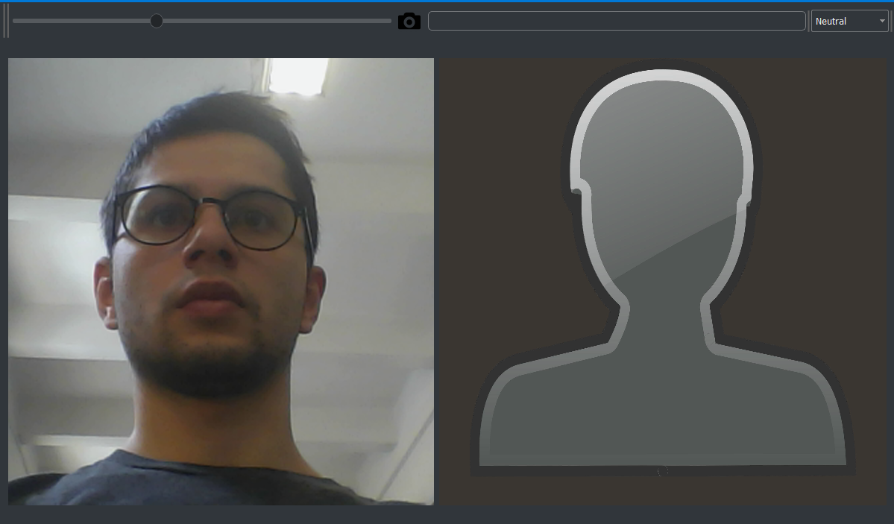

# 3DMM Facial Expression from Webcam
Application to modify the 3D faces

## Run
- download the [repository](https://github.com/AlessandroSoci/3DMM-Facial-Expression-from-Webcam.git) (clone or zip download)
- download extra-files from [drive](https://drive.google.com/drive/u/1/folders/1W5UEDR_ovW8lOFOL3H3gR1e97cARGCBh)
- unzip extra-files and add it on expression_code/data path
- run `main.py` or `expression_to_neutral.py`

The scripts will output the same window but with different application dependently if you run `main.py` or `expression_to_neutral.py`.

## Introduction
The main project is an application that show an expressive face, having a neutral face as a base. 

Furthermore the application can show a neutral face, having an expressive face as a base, but it is only a experiment,
and we did not spend a lot of time with it.

## Goals
0. Recognize the face of the subject
1. Build the 3D face model
2. Apply the texture to the 3D model
3. Modify the expression

## Technologies
- The interface is developed with the PyQt Framework using Python.
- OpenCV allow to have control on camera.
- The face landmark are calculated thanks to [Python packages](https://github.com/ageitgey/face_recognition).
- 3D Morphable Model to create the image.

The process for calculating the landmark face has a significant computational cost and also the building of 3D model.
This involve in a lag and in a slowdown application.

## Interface and Description
To provide a visual feedback to the user, the system implements a simple interface.

The user will see a live view of the scene on the left size of the window, and on the right part only a simple imagine.
On the top there is a Toolbox with witch the user can interact. It has the following widget:
- Slider: to zoom, preset x1.3;
- Icon camera: to take picture;
- Progress Bar: shows the percentage of the work done;
- Combo Box: possibility to choose the expression:
    1. neutral
    2. surprise
    3. happy
    4. contempt
    5. sadness
    6. disgust
    7. angry
    8. fear

###
The icon allow to take a picture, and so if a face is present in the photo, the application identifies it and calculates
the landmark face. Now it can create the 3D model with the texture, but only the image 2D will be show on the right size
of the window. On the top left we have the combo box that allow to choose the expression to apply to subject face.
 After few second the new artificial face will appear.

The biggest problem is the resolution of the image of model. Because to create the 3D morphable model, it's necessary an
image 256*256, and consequently the texture have low resolution. This problem was partially resolved applying a blur 
effect on the texture.

##
Another application has been developed with the same interface, but with different function. Here the user can obtain
the own artificial neutral face, having an expression face. Unfortunately the application does not manage to recognize
the expression of user, but he has to choose the expression on the combo box.

## Conclusion

The main application show the hypothetical expression face of the subject. This project want to help people can't
express themselves through expression face, like autistics. They make practice, watching themselves on the
live camera and having the model of themselves on the right.

## Requirements

| Software                                                    | Version        | Required |
| ------------------------------------------------------------|:--------------:| --------:|
| **Python**                                                  |     >= 3       |    Yes   |
| **Numpy** (Python Package)                                  |Tested on v1.13 |    Yes   |
| **OpenCV** (Python Package)                                 |Tested on v3    |    Yes   |
| **Pillow** (Python Package)                                 |Tested on v5.10 |    Yes   |
| **QDarkStyle** (Python Package)                             |Tested on v2.5.1|    Yes   |
| **dlib** (Python Package)                                   |Tested on v19.10|    Yes   |
| **face recognition** (Python Package)                       |Tested on v1.2.2|    Yes   |
| **h5py** (Python Package)                                   |Tested on v2.7  |    Yes   |
| **matplotlib** (Python Package)                             |Tested on v2.2.2|    Yes   |
| **scipy** (Python Package)                                  |Tested on v1.1.0|    Yes   |
| **tensorflow** (Python Package)                             |Tested on v1.7.0|    Yes   |

