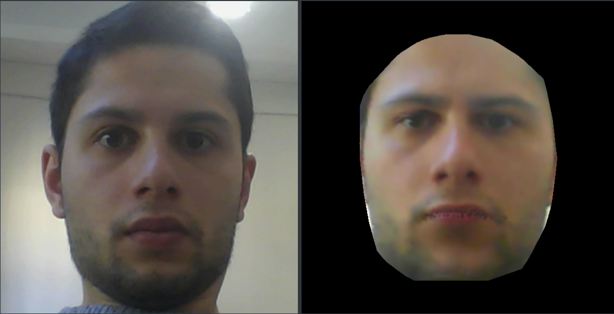
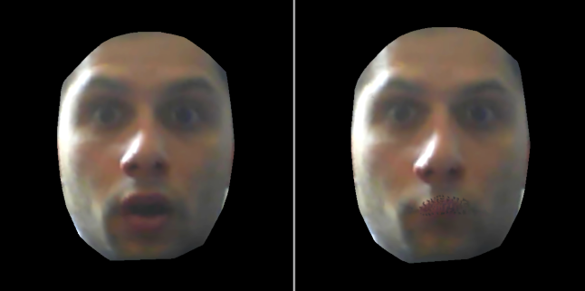

# 3DMM Facial Expression from Webcam
Application to modify the faces in 3D

## Run
- download the [repository](https://github.com/AlessandroSoci/3DMM-Facial-Expression-from-Webcam.git) (clone or zip download)
- download extra-files from [drive](https://drive.google.com/drive/u/1/folders/1W5UEDR_ovW8lOFOL3H3gR1e97cARGCBh)
- unzip extra-files and add it on expression_code/data path
- download landmarks predictor from [TensorFace](https://github.com/AKSHAYUBHAT/TensorFace/blob/master/openface/models/dlib/shape_predictor_68_face_landmarks.dat)
- add it on the expression code folder
- run `main.py` or `expression_to_neutral.py`

The scripts will output an identical window either for you run `main.py` or for `expression_to_neutral.py`, but the goals are different.

## Introduction
The main project is the creation of an application to generate expressive 3D faces starting from a photo of the neutral face as a base. 

Furthermore, the application can show a neutral face, having an expressive face as a base, but it is only an experiment,
and we did not spend a lot of time with it.

## Goals
0. Recognize the face of the subject
1. Build the 3D face model
2. Apply the texture to the 3D model
3. Modify the expression

## Technologies
- The interface is developed with the PyQt Framework using Python.
- OpenCV allows having control of the camera.
- The face landmark are calculated thanks to [Python packages](https://github.com/ageitgey/face_recognition).
- 3D Morphable Model to create the image.

The process for calculating the landmark face has and the building of 3D model has a high computational cost 
This involves a lag and in a slowdown application.

## Interface and Description
To provide a visual feedback to the user, the system implements a simple interface.

The user will see a live view of the scene on the left side of the window, and on the right part, only a simple image.
On the top, there is a Toolbox with which the user can interact. It has the following widget:
- Slider: to zoom, preset x1.3;
- Icon camera: to take a photo;
- Progress Bar: shows the percentage of the work;
- Combo Box: possibility to choose the expression:
    1. neutral
    2. surprise
    3. happy
    4. contempt
    5. sadness
    6. disgust
    7. angry
    8. fear

###
The icon allows taking a picture. If a face is present in the photo, the application identifies it and computes
the landmark face. Now it can create the 3D model with the texture, but only the image 2D will be shown on the right side
of the window. On the top left, we have the combo box that allows choosing the expression to apply to the subject face.
After a few seconds, the new artificial face will appear.
Below an example is shown: from neutral to angry.
 
 

The biggest problem is the resolution of the image of the 3D model. Because to create the 3D morphable model, it's necessary an
image 256*256, and consequently the texture has low resolution.

##
Another application has been developed with the same interface, but with a different function. Here the user can obtain
the own artificial neutral face, having an expressive face. Unfortunately, the application does not manage to recognize
the expression of the user, but the user has to choose the expression on the combo box. Below it shows an example, from surprise to neutral.

## Conclusion

The main application shows the hypothetical expression face of the subject. This project wants to help people who can't
express themselves through expression face, like autistics. They do practice, watching themselves on the
live camera on the left and having the model of themselves on the right.

## Requirements

| Software                                                    | Version        | Required |
| ------------------------------------------------------------|:--------------:| --------:|
| **Python**                                                  |     >= 3       |    Yes   |
| **Numpy** (Python Package)                                  |Tested on v1.13 |    Yes   |
| **opencv-python** (Python Package)                                 |Tested on v3    |    Yes   |
| **pillow** (Python Package)                                 |Tested on v5.10 |    Yes   |
| **QDarkStyle** (Python Package)                             |Tested on v2.5.1|    Yes   |
| **dlib** (Python Package)                                   |Tested on v19.10|    Yes   |
| **face_recognition** (Python Package)                       |Tested on v1.2.2|    Yes   |
| **h5py** (Python Package)                                   |Tested on v2.7  |    Yes   |
| **matplotlib** (Python Package)                             |Tested on v2.2.2|    Yes   |
| **scipy** (Python Package)                                  |Tested on v1.1.0|    Yes   |
| **tensorflow** (Python Package)                             |Tested on v1.7.0|    Yes   |
| **imutils** (Python Package)                                |Tested on v0.4.6|    Yes   |
| **keras** (Python Package)                                  |Tested on v2.2.0|    Yes   |
| **sklearn** (Python Package)                                |Tested on v0.19.1|   Yes   |
